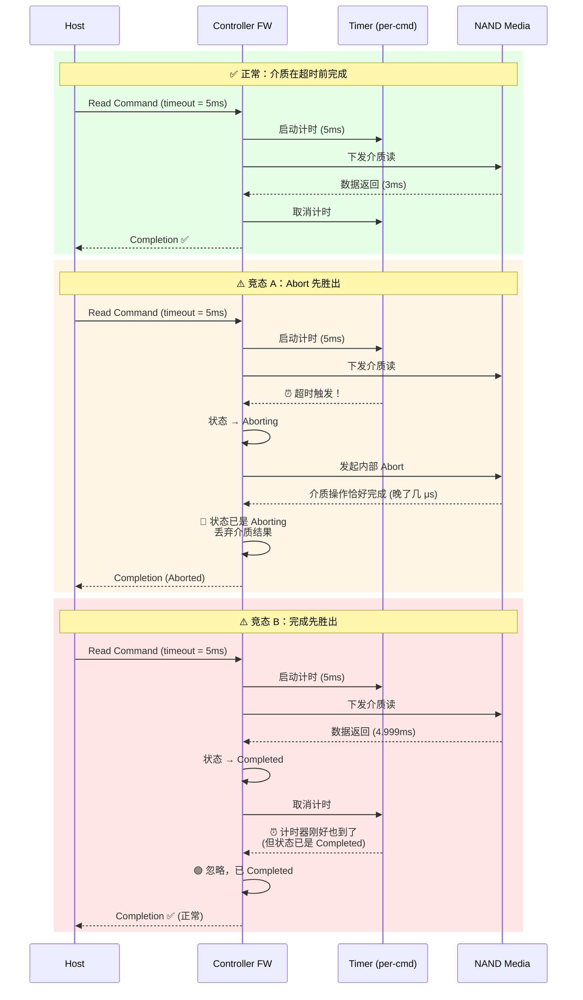
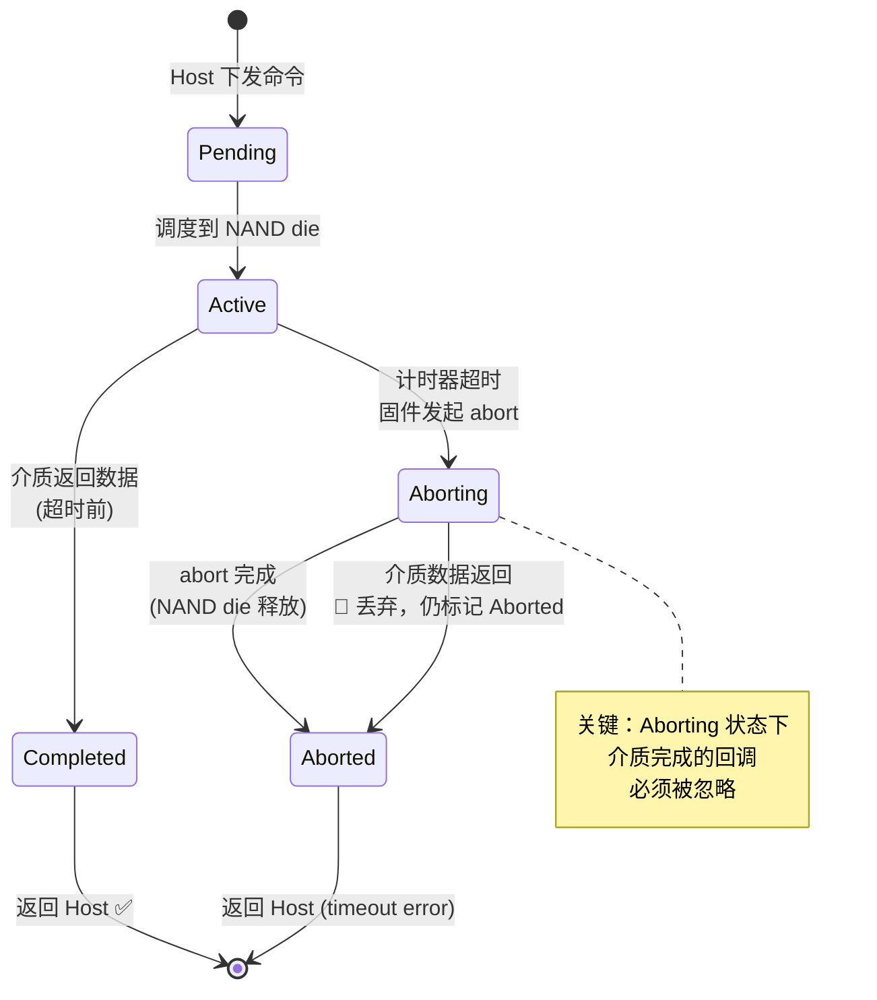

# 盘侧超时机制

## 核心要点

- **问题**：KV Cache 场景中，SSD 盘侧长尾延迟（P99.9 可达数 ms 甚至百 ms）导致 GPU 空等，浪费算力。
- **根因分布**：随 SSD 生命周期动态变化——新鲜盘 GC 主导，老化盘 read-retry/ECC 上升，全程 chip 队列不均衡是最直接因。
- **方案**：盘侧 per-IO 超时——要么快速返回数据，要么快速返回失败让 GPU 重算。
- **协议载体**：NVMe CDL（Command Duration Limits）最接近需求，DW2 可作为自定义 timeout 字段的最佳载体。
- **可靠性核心**：盘侧 atomic abort 状态机 + Host/盘侧两层超时时序配合 + DMA 截断。

## 详细内容

见下方分析结论。

## 相关链接
- [[内核IO子系统.MOC]]

---

## 分析结论（2026-05-01）

### 1. IO长尾时延的成因

SSD 长尾的根本原因随 **SSD 生命周期** 动态变化，不存在单一固定的比例分布。以下按三种典型状态展开。

#### 1.1 新鲜 / 轻度使用的 SSD

此阶段 NAND 介质健康，Raw Bit Error Rate（RBER）低，ECC/read-retry 很少触发。长尾主要来自 **GC 内部操作**和**chip 级资源调度**。

| 分类 | 具体原因 | 典型时延量级 |
|------|---------|:----------:|
| **GC 干扰** | Foreground GC 无空闲块时直接插入 IO 路径；GC 与 user IO 争抢 die/plane/channel | 500μs-10ms |
| **GC 内部构成** | Du et al. (2021) 实测 3D NAND 下 **page migration 占 GC 延迟的 74-92%**，block erase 仅占 8-26%。迁移-擦除比最高达 11.45× | — |
| **Chip 队列不均衡** | Elyasi et al. (2019) 发现 GC 并非高端 SSD 长尾的主因——**flash chip 间队列长度方差**才是。读请求排队等在同 chip 上的慢操作（write/erase）后 | 100μs-1ms |
| **FTL 地址转换** | L2P cache miss → 需从 NAND 读映射表，额外 1-2 次介质访问 | 100-500μs |

**此阶段特征**：GC 和 chip 排队共同主导，TTFLASH (FAST 2017) 测量 GC 导致 P99-P99.99 尾延迟恶化 **5-138×**。

#### 1.2 老化 / 磨损加深的 SSD

随着 P/E cycles 累积，RBER 上升，read-retry 和强 ECC 解码逐渐成为长尾的主要来源。

| 分类 | 具体原因 | 典型时延量级 |
|------|---------|:----------:|
| **Read Retry 级联** | NAND 读错 → 多级 read retry（调整 Vref 重读、软解码 LDPC）→ NAND 级 RAID 重建。CVSS (FAST 2024) 实测一台写入 9 PB 的企业级 SSD：纯读场景下吞吐下降 **37%（随机读）和 38%（顺序读）**，完全由 error handling 导致，不涉及 GC | 1-10ms |
| **预防性数据搬迁** | Read disturb 累积 → 固件触发数据重写 → 额外写压力间接加剧 GC | 1-100ms |
| **坏块替代** | 坏块 remapping、wear-leveling 搬迁 | 1-100ms |

**此阶段特征**：read-retry/ECC 从新鲜盘的几乎可以忽略，上升到可能**贡献 30-50% 以上的长尾事件**。Hao et al. (FAST 2016) 对 NetApp 生产环境数百万 SSD 小时的分析也证实：长尾根因是"drive internal idiosyncrasies"（固件、GC、磨损），而非外部 IO 负载不均。

#### 1.3 高利用率 / 接近满盘的 SSD

当 SSD 容量利用率 >~90%，空闲块紧缺，GC 触发频率剧增，再次成为主导：

- GC 频率 ↑ → GC 与 user IO 碰撞概率 ↑
- Over-provisioning 耗尽 → 每次 GC 需迁移更多有效页 → 单次 GC 延迟 ↑
- 企业级 SSD 通常预留 ~28% OP 来缓解，但 consumer 级（~7% OP）在高利用率下长尾会急剧恶化 [1][2]

#### 1.4 全覆盖因素

以下因素横跨所有生命周期阶段，但绝对发生频率低：

| 分类 | 具体原因 | 典型时延量级 |
|------|---------|:----------:|
| **PCIe 链路错误** （这种盘侧控制不了）| Link error → recovery/training | 10-100ms |
| **Thermal Throttling** | 温度超阈值 → 强制降频 | 1-100ms |
| **多 tenant 资源竞争** | 多 SQ 仲裁、buffer 满回压（池化场景尤为突出） | 100μs-1ms |

#### 1.5 关键 Insight

1. **没有固定占比**：长尾成因随 SSD 生命周期从"GC 主导" → "GC + read-retry 混合" → "read-retry 可能反超" 不断漂移。
2. **P99.9 vs P50 可能差 100 倍以上**：长尾呈"少数请求拖垮整体"的特征。
3. **Chip 级排队是最直接因**（Elyasi 2019）：GC 和 read-retry 是触发源，但最终体现为 chip channel 上的 queue buildup。

#### 1.6 现有机制的覆盖盲区

| 长尾成因 | LR（Limited Retry） | CDL（T10） | 盘侧超时 |
|----------|:---:|:---:|:---:|
| GC 干扰 | ❌ 无关 | ⚠️ hint 级别 | ✅ 精确控制 |
| Chip 队列不均衡 | ❌ 无关 | ⚠️ hint 级别 | ✅ 精确控制 |
| Read retry / ECC | ✅ 可覆盖 | ⚠️ hint 级别 | ✅ 精确控制 |
| FTL L2P miss | ❌ 无关 | ⚠️ hint 级别 | ✅ 精确控制 |
| 磨损/温控/搬迁 | ❌ 无关 | ⚠️ hint 级别 | ✅ 精确控制 |
| PCIe 链路 | ❌ 无关 | ❌ 无关 | ❌ 无法控制 |

**结论**：
- LR 只覆盖 read-retry 这一个成因——在新鲜盘上几乎无用，在老化盘上才有价值。且 LR 是"放弃恢复"语义而非时间维度超时。
- CDL 名义覆盖全部但仅为 hint，device 可忽略。
- 盘侧超时覆盖除 PCIe 外的全部长尾场景，且是强制语义——这才是 KV Cache 需要的确定性。

---

### 2. 盘侧超时的意义是否合理？

**非常合理，且对 KV Cache 场景尤其适合。** 核心逻辑链条：

1. **KV Cache 数据是可重算的**——这是前提。如果读失败，GPU 重算的代价是已知、可控的（额外 FLOPs），而 GPU 等待 IO 的代价是完全 idle，浪费远大于重算。
2. **确定性优于不确定性**——"10ms 返回数据或失败" 比 "1-1000ms 之间随机成功" 更容易做流水线调度。
3. **盘侧做比 Host 侧做的优势**：
   - 盘侧知道真实的介质/队列状态，可以做更精准的判断（"这个请求已经 retry 两次了，大概率还要再花 50ms，不如现在就失败"）。
   - 池化存储场景下，盘侧可以聚合数千 client 的请求，做全局调度和预取。

**需要权衡的点**：
- 超时阈值设得太紧 → 频繁触发重算，浪费 GPU 算力
- 设得太松 → 长尾控制效果弱
- 建议：**per-IO 可配置**，不同层/不同 attention head 可以使用不同阈值

---

### 3. NVMe 协议中已有的盘侧超时机制

| 机制 | 能力 | 与要点的差距 |
|------|------|------------|
| **CDL（Command Duration Limits, NVMe 讨论中, 未正式纳入）** | Host 可以对每个命令指定 3 个 duration limit（1ms/100ns 粒度），device 可以据此做内部调度 | Spec 只要求 device "consider" 这个限时，并未强制要求超时后 abort，也**没有定义**超时后的 completion status |
| **Limited Retry** | 介质读错时，是否要 controller 花大代价恢复 | 不是时间维度，而是重试次数维度 |
| **Set Features Timeout** | Host 侧看门狗计时器 | 不是 per-command，也不是盘侧控制的 |
| **Abort 命令** | Host 主动 abort 指定 command ID | 这是 Host 驱动的超时行为，不是盘侧主动的 |

**结论**：标准 NVMe spec 里**没有现成的**"盘侧超时后主动 abort + 返回特定状态"的机制。CDL 最接近，但也只提供 hint 而非强制语义。

---

### 4. 新定义盘侧超时机制的保留字段

以 **NVMe Read/Write 命令** 的 Dword 布局来看，有以下几个可用空间：

| 位置 | 大小 | 说明 |
|------|------|------|
| **DW2** (byte 8-11) | 4 bytes | 标准 spec 中 DW2 在 NVM Command Set 下是 Reserved——**最佳候选** |
| **DW13 (DSM) bits 24:16** | 9 bits | DSPEC 字段，可以用一部分作为超时 hint |
| **DW12 bits 25:16** | 10 bits | Reserved / DSPEC 区域 |
| **PI fields (DW14-15)** | 8 bytes | 如果不使用 PI，Reference Tag + Application Tag 是 Reserved |

**建议**：使用 **DW2** 作为 timeout 字段（如 16 bits，单位 μs 或 100μs），这是最干净的位置，完全不冲突现有语义。

如果希望完全兼容 CDL，也可以在 **CDL 的 Duration Descriptor** 中定义 vendor-specific 的 interpretation——如 "Duration Limit A = 软 deadline，超过后尝试尽力完成；Duration Limit B = 硬 deadline，超过直接 abort"。

---

### 5. 可靠性实现中需要额外考虑的问题

#### 5.1 竞态：盘侧 abort 与完成的重叠

盘侧判定超时 → 发起内部 abort → (同时) 介质操作恰好完成 → 命令状态是什么？已完成还是已 abort？





**方案**：盘侧 firmware 需要有一个 **atomic state machine** per command slot：`Pending → Active → Aborting → Aborted | Completed`。核心在于 Aborting 状态下收到介质完成回调时，**必须检查状态**——如果已是 Aborting，丢弃介质结果并走 Aborted 路径。伪代码：

```c
void on_media_done(cmd_t *cmd) {
    if (cmd->state == ABORTING) {
        drop_result(cmd);          // 丢弃
        complete_aborted(cmd);     // 返回 abort 状态给 Host
    } else {
        cancel_timer(cmd);
        cmd->state = COMPLETED;
        complete_success(cmd);     // 正常完成
    }
}
```

#### 5.2 两层超时的时序配合

```
Host timeout > Disk timeout + Net RTT + Completion processing time
```

必须保证 Host 侧 timeout 值显著大于盘侧，否则出现 **Host 比盘先 abort**——这违背了"让盘先判断"的初衷。

#### 5.3 Host 发 Abort 时盘正在自 abort

- Host 发送 NVMe Abort 命令（指定 command ID）
- 盘侧 firmware 处理 Abort 时，该命令是否还在 pending？
- 如果盘已经自行完成了该命令（带超时错误），Abort 应返回 **Command Already Completed** status

#### 5.4 DMA in-flight 的处理

- Read abort 时，数据可能已经 DMA 了一部分到 host memory
- 需要确保要么 DMA 完全停止（PCIe TLP 层面截断），要么 host 侧标记该 buffer 无效
- 否则可能造成 **stale/corrupted data** 被上层误用

#### 5.5 写命令的 abort 语义不同

- Read abort 的后果：数据无效 → 重算
- Write abort 的后果：**partial write** → 数据处于未知状态
- 对于 KV Cache，Write abort 后 host 需要感知并标记对应 KV 块为 invalid

#### 5.6 健康监测与降级

- 频繁超时的 LBA 范围 → 可能对应坏块，应触发 wear-leveling / bad block remapping
- 如果某个 NAND die 持续超时 → 考虑 controller 级别的 QoS 隔离

#### 5.7 盘侧 abort 风暴

- 极端情况下大量命令同时超时 → 内部 abort 本身消耗 controller 资源
- 需要速率限制和优先级处理

---

### 6. KV Cache 读取超时的代价模型

盘侧超时后上层需要重算，但**不是所有超时的代价都一样**——丢失的 KV 所处层越靠前（靠近 embedding），重算代价越大。

#### 6.1 代价的层依赖

对于一个 L 层 Transformer，KV Cache 按层组织：$(K_0, V_0), (K_1, V_1), ..., (K_{L-1}, V_{L-1})$。若第 $l$ 层的 KV 丢失：

- 前 $l$ 层（0 ~ $l$-1）的 KV **仍然可用**，无需重算
- 第 $l$ 层需要**重新计算该层的 KV**：需要前一层（$l$-1）的 hidden states 作为输入
- 由于 hidden states 通常不缓存（只缓存 K/V），第 $l$-1 层的 hidden states 也得重算
- 这引发**级联重算**：从第 $l$ 层一直重算到最后一层 $L$-1

**代价 ≈ $(L - l) \times$ 单层 prefill FLOPs $\times$ 受影响 token 数**

#### 6.2 层位置对代价的量级差异

以 L=80 的典型大模型为例：

| 丢失层 | 需重算的层数 | 相对代价 | 说明 |
|--------|:----------:|:------:|------|
| layer 0（第一层） | 80 层 | **80×** | 等价于一次完整 prefill |
| layer 20 | 60 层 | **60×** | |
| layer 40（中间层） | 40 层 | **40×** | |
| layer 60 | 20 层 | **20×** | |
| layer 79（最后一层） | 1 层 | **1×（基线）** | 代价最小 |

**首层丢失代价是末层丢失的 L 倍**——对 80 层模型就是 80 倍差距。

#### 6.3 Token 位置的影响

丢失 KV 对应的 token 在序列中的位置也很关键：

- **前缀 token 丢失**（序列前段）：所有后续 token 的 attention 都需要它 → 影响范围大
- **尾部 token 丢失**（序列后段）：只有新生成的 token 需要 attend 它 → 影响范围小

在因果注意力下，第 $t$ 个 token 的 KV 被第 $t+1$ 到第 $T$ 个 token 依赖，影响范围 = $T - t$。

#### 6.4 两层代价叠加

综合层位置 + token 位置，超时代价的热力图：

```
           token位置 →
层位置↓    [前缀]                [尾部]
layer 0    ██ 极高 (80L×T)       ██ 高 (80L×1)
layer 40   ██ 中   (40L×T)       █  中低 (40L×1)
layer 79   █  中低 (1L×T)        ░  极低 (1L×1)
```

**最大代价**：layer 0 + 前缀 token → 完整 prefill 重算，FLOPs = 单次推理的数千倍。

**最小代价**：layer 79 + 尾部 token → 仅重算 1 层，几乎无感。

#### 6.5 对超时策略的启示

1. **per-layer 超时阈值**：越靠前的层，timeout 设得越松（宁可多等，避免触发级联重算）；越靠后的层，timeout 可以更激进（fail fast 代价低）。
2. **per-token 超时阈值**：序列前缀的 KV 读取超时设松，尾部设紧。
3. **可落地简化**：把 KV Cache 按层分为 2-3 个 tier，每个 tier 用不同 timeout profile，不需要 per-layer 粒度：
   - Tier 1（layer 0 ~ L/3，前 1/3 层）：timeout = 盘侧 P95 延迟 × 2
   - Tier 2（layer L/3 ~ 2L/3）：timeout = 盘侧 P95 延迟 × 1
   - Tier 3（layer 2L/3 ~ L）：timeout = 盘侧 P50 延迟
4. **与 DW2 的结合**：Host 下发 IO 时在 DW2 写入 timeout 值，盘侧 firmware 直接使用，无需额外查表。


---

## 进度与后续计划 2026.5.1

### 已完成

- [x] **背景调研**：KV Cache 场景的长尾时延成因分析，按 SSD 生命周期分段，覆盖 GC / read-retry / chip 排队 / FTL miss / PCIe 等六类成因，附文献支撑
- [x] **协议调研**：NVMe 已有机制评估（CDL、Limited Retry、Set Features Timeout、Abort），T10 CDL 的 hint vs mandatory 语义分析；DW2 作为自定义 timeout 字段的可行性确认
- [x] **两层 abort 问题初步梳理**：Host+盘侧两层超时的时序配合、竞态（5.1 状态机）、DMA in-flight、Write abort 语义差异、abort 风暴、健康监测闭环——共 6 个子问题已识别

### 待完成

- [ ] **多 abort 问题细化 + 方案对比**：深入分析盘侧超时、Host 侧超时、盘+Host 结合的三种方案在以下维度的对比：
  - 问题覆盖面（介质层 / GC / 网络抖动 / PCIe 错误）
  - 实现复杂度（Host 驱动改动量、盘侧固件改动量、对 NVMe 合规性的影响）
  - 收益（P99.9 尾延迟降低幅度、GPU 利用率提升）
  - 输出：一张对比表 + 推荐方案
- [ ] **盘侧现状调研**（需上班获取信息）：当前使用的 SSD 盘侧是否已有超时机制？能否每个 IO 单独设置超时时间？固件是否支持 per-command abort？

---

## 参考文献

1. **Elyasi, N., Choi, C., Sivasubramaniam, A., et al.** *"Trimming the Tail for Deterministic Read Performance in SSDs."* IISWC 2019. DOI: [10.1109/IISWC47752.2019.9042073](https://doi.org/10.1109/IISWC47752.2019.9042073)
   - 核心发现：GC 并非高端 SSD 长尾主因，flash chip 间队列长度方差才是。ATLAS 调度器将 P99.99 读延迟降低 10×。
   - 本地：IEEE 付费墙，未下载到全文

2. **Du, Y., Liu, W., Gao, Y., Ausavarungnirun, R.** *"Observation and Optimization on Garbage Collection of Flash Memories: The View in Performance Cliff."* Micromachines, 2021. DOI: [10.3390/mi12070846](https://doi.org/10.3390/mi12070846)
   - 核心发现：3D NAND 下 page migration 占 GC 延迟的 74-92%，block erase 仅 8-26%。
   - 本地：[references/Du_2021_Observation_Optimization_GC.pdf](../references/Du_2021_Observation_Optimization_GC.pdf)

3. **Hao, M., Soundararajan, G., Kenchammana-Hosekote, D., Chien, A.A., Gunawi, H.S.** *"The Tail at Store: A Revelation from Millions of Hours of Disk and SSD Deployments."* FAST 2016, USENIX. URL: [USENIX](https://www.usenix.org/conference/fast16/technical-sessions/presentation/hao)
   - 核心发现：NetApp 生产环境中数百万 SSD 小时分析，0.6% 时间 SSD 比同类慢 2× 以上，根因是 drive internal idiosyncrasies 而非外部 IO 不均。
   - 本地：[references/Hao_2016_Tail_at_Store.pdf](../references/Hao_2016_Tail_at_Store.pdf)

4. **Yan, S., et al.** *"Tiny-Tail Flash: Near-Perfect Elimination of Garbage Collection Tail Latencies in NAND SSDs."* FAST 2017, USENIX. URL: [USENIX](https://www.usenix.org/conference/fast17/technical-sessions/presentation/yan)
   - 核心发现：GC 导致 P99-P99.99 尾延迟恶化 5-138×（相比理想无 GC 场景）。
   - 本地：[references/Yan_2017_Tiny_Tail_Flash.pdf](../references/Yan_2017_Tiny_Tail_Flash.pdf)

5. **Nanos, A., et al.** *"The Design and Implementation of a Capacity-Variant Storage System (CVSS)."* FAST 2024, USENIX. URL: [NSF PAR](https://par.nsf.gov/biblio/10514269)
   - 核心发现：老化 SSD（写入 9 PB）纯读吞吐下降 37-38%，完全由 read-retry/ECC 导致。Per-PB 退化率约 4.2-4.3%。
   - 本地：下载超时，未下载到全文
